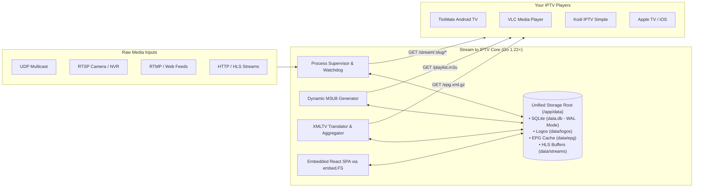

<div align="center">

# 📺 Stream to IPTV

### *Turn any raw media stream into a polished, self-healing IPTV service.*

[](https://github.com/varmakarthik12/stream-to-iptv/releases)
[](https://github.com/varmakarthik12/stream-to-iptv/pkgs/container/stream-to-iptv)
[](go.mod)
[](LICENSE)

<p align="center">
  <a href="#-why-stream-to-iptv">Why Stream to IPTV?</a> •
  <a href="#-key-features">Features</a> •
  <a href="#-architecture--implementation-details">Implementation Details</a> •
  <a href="#-quickstart-with-docker">Docker Quickstart</a> •
  <a href="#-local-setup--development">Local Setup</a> •
  <a href="#-running-standalone-binaries">Pre-built Binaries</a> •
  <a href="#-supported-iptv-players">Player Setup</a> •
  <a href="docs/features-and-guide.md">Documentation</a>
</p>

</div>

---

## 💡 Why Stream to IPTV?

Have you ever tried streaming a local UDP multicast feed, an RTSP security camera, or a remote web stream to your living room TV? 

Typically, that means wrestling with raw FFmpeg commands, manually editing brittle `.m3u` text files, hunting down matching XMLTV channel IDs across multiple websites, and constantly restarting dead processes when network blips occur.

**Stream to IPTV 2.0** solves this once and for all. It gives you a sleek, modern web console backed by an embedded SQLite database and an automated process supervisor:

- ❌ **No more hand-editing JSON or text files**
- ❌ **No more 24/7 CPU churn for channels nobody is watching**
- ❌ **No more broken TV guides or missing logos**
- ✅ **One-click M3U playlist & XMLTV EPG ready for any smart TV or IPTV app**

---

## ✨ Key Features

<table>
  <tr>
    <td width="50%">
      <h3>🎛️ Modern Web Management UI</h3>
      <p>A responsive dashboard built with React and Tailwind CSS, embedded right into the Go binary. Manage channels, categories, EPG, and logos visually with zero external web server dependencies.</p>
    </td>
    <td width="50%">
      <h3>⚡ Smart On-Demand Transcoding</h3>
      <p>Save massive amounts of CPU, memory, and bandwidth. FFmpeg spins up only when someone is actively watching and gracefully shuts down after a configurable inactivity timeout.</p>
    </td>
  </tr>
  <tr>
    <td width="50%">
      <h3>🛡️ Self-Healing Stream Watchdog</h3>
      <p>Source feeds drop or freeze? The automated watchdog monitors process health and automatically recovers failing streams after a customizable timeout.</p>
    </td>
    <td width="50%">
      <h3>📅 Multi-Source XMLTV EPG Aggregator</h3>
      <p>Import multiple upstream XMLTV feeds (raw <code>.xml</code> or compressed <code>.xml.gz</code>), map channels with search, and configure automatic fallback guides.</p>
    </td>
  </tr>
  <tr>
    <td width="50%">
      <h3>🖼️ Built-in Logo Asset Library</h3>
      <p>Upload logos directly or import from web URLs. Assets are stored locally inside the application folder and easily reused across multiple channels without leaving the stream editor.</p>
    </td>
    <td width="50%">
      <h3>📦 Single Unified Storage Volume</h3>
      <p>Your database, uploaded logos, cached guides, and temporary segments all live under a single root directory (<code>/app/data</code>). One volume mount persists everything.</p>
    </td>
  </tr>
</table>

---

## 🏗️ Architecture & Implementation Details

Stream to IPTV is built for speed, portability, and zero-headache operational simplicity.



### Technical Stack & Decisions

- **Pure Go SQLite Engine**: Uses [`modernc.org/sqlite`](https://gitlab.com/cznic/sqlite) (zero CGO). Compiles cleanly to any OS and architecture (`linux`, `darwin`, `windows` on `amd64` and `arm64`) without requiring external C toolchains or cross-compilers.
- **Embedded Schema Migrations**: SQL migration files are compiled into the binary via `//go:embed` and applied sequentially on startup (`internal/db/migrations/`).
- **Process Supervisor & Watchdog**: Native goroutine supervisor managing FFmpeg child processes (`os/exec`). Features:
  - **Touch Lifecycle**: Requests to `/stream/<slug>/<slug>.m3u8` or `.ts` touch the stream activity timer and auto-spawn FFmpeg if idle.
  - **Inactivity Sweeper**: Automatically stops FFmpeg processes after the configured idle timeout expires (default: 180s).
  - **Self-Healing Watchdog**: Detects persistent error states and triggers automated restarts if an error exceeds the stream's recovery threshold (e.g. 30s).
  - **Log Ring Buffer**: Retains the last 500 lines of FFmpeg stderr/stdout per stream for live UI inspection.
- **Streaming XMLTV Engine**: Implements a streaming SAX decoder (`encoding/xml.Decoder`) supporting both raw `.xml` and `.xml.gz`. Parses multi-gigabyte EPG files with low memory consumption, translates channel IDs, and maps primary/fallback schedules into `/epg.xml`.
- **Embedded React SPA**: Built with React 18, Vite 5, TypeScript, and Tailwind CSS. The compiled production bundle (`web/dist`) is embedded directly into the Go binary using `//go:embed all:dist`.

---

## 🚀 Quickstart with Docker

The fastest and cleanest way to run Stream to IPTV in production is using Docker.

### Option A: Docker Compose (Recommended)

Create a `docker-compose.yml` file:

```yaml
services:
  stream-to-iptv:
    image: ghcr.io/varmakarthik12/stream-to-iptv:latest
    container_name: stream-to-iptv
    restart: unless-stopped
    ports:
      - "8068:8068"
    volumes:
      # Single mount: database, logos, cached guides, and stream buffers persist here
      - ./data:/app/data
    environment:
      - PORT=8068
      - DATA_DIR=/app/data
```

Start the container:

```bash
docker compose up -d
```

> [!TIP]
> **Using Local UDP Multicast?** If your incoming stream is a local UDP multicast (e.g. `udp://@239.255.0.1:1234`), add `network_mode: host` to your compose service so Docker can receive multicast packets without NAT restrictions.

### Option B: Docker CLI

```bash
# 1. Create a persistent named volume
docker volume create iptv_data

# 2. Run the container
docker run -d \
  --name stream-to-iptv \
  -p 8068:8068 \
  -v iptv_data:/app/data \
  --restart unless-stopped \
  ghcr.io/varmakarthik12/stream-to-iptv:latest
```

Open your browser and visit **`http://localhost:8068`** to complete the initial setup wizard!

---

## 💻 Local Setup & Development Instructions

Follow these instructions to run and develop Stream to IPTV locally on your machine.

### Prerequisites

Ensure you have the following installed:
1. **Go**: Version 1.22 or higher ([golang.org](https://go.dev/dl/))
2. **Node.js**: Version 20 or higher & npm ([nodejs.org](https://nodejs.org/))
3. **FFmpeg**: Must be installed and available in your system `PATH`:
   - **Linux**: `sudo apt update && sudo apt install ffmpeg`
   - **macOS**: `brew install ffmpeg`
   - **Windows**: `winget install Gyan.FFmpeg` or download from [ffmpeg.org](https://ffmpeg.org)

---

### Step 1: Clone the Repository

```bash
git clone https://github.com/varmakarthik12/stream-to-iptv.git
cd stream-to-iptv
```

---

### Step 2: Full Development Environment (Live UI Reload + Backend)

For the best developer experience with Hot Module Replacement (HMR) for the UI:

#### Terminal 1 — Start the Go Backend Server
```bash
# Runs backend API, stream supervisor, and SQLite on port 8068
go run ./cmd
```

#### Terminal 2 — Start the Vite React Frontend
```bash
cd web
npm install
npm run dev
```

- The Vite dev server will start on **`http://localhost:3000`**.
- It automatically proxies all API (`/api`), stream (`/stream`), playlist (`/playlist.m3u`), and EPG (`/epg.xml`) requests to the Go backend on port `8068`.

---

### Step 3: Running Standalone Locally (Single Binary Mode)

If you just want to run the full application locally as a single self-contained server:

```bash
# 1. Build the production UI bundle
npm --prefix web install
npm --prefix web run build

# 2. Run the Go server (serves both API and embedded React UI)
go run ./cmd --port 8068 --data-dir ./data
```

Visit **`http://localhost:8068`** in your browser. All data will be automatically saved into the local `./data` folder.

---

### Step 4: Running Unit Tests

Run the test suite covering SQLite migrations, repository operations, stream configurations, and M3U8 generation:

```bash
go test -v ./...
```

---

### Step 5: Building Production Binaries

To produce standalone release binaries with embedded UI assets:

```bash
# Using npm script helper
npm run build

# Or manually:
npm --prefix web run build
go build -ldflags="-w -s" -o stream ./cmd
```

On Windows, this creates `stream.exe`. On Linux/macOS, it creates `stream`.

---

## 📦 Running Standalone Pre-Built Binaries

Pre-compiled, self-contained binaries with the complete React web UI embedded are available on our **[Releases](https://github.com/varmakarthik12/stream-to-iptv/releases)** page.

### Download and Execute

```bash
# Linux / macOS
chmod +x stream
./stream --port 8068 --data-dir ./data

# Windows (PowerShell or Command Prompt)
.\stream.exe --port 8068 --data-dir .\data
```

---

## 📱 Supported IPTV Players

Once your channels are configured, grab your two universal feed URLs from the top banner:
- **Playlist URL**: `http://<SERVER_IP>:8068/playlist.m3u`
- **EPG Guide URL**: `http://<SERVER_IP>:8068/epg.xml` *(or `.xml.gz` for compressed guides)*

| Player | Platform | Setup Steps |
| :--- | :--- | :--- |
| **TiviMate** | Android TV / Fire TV | **Settings** &gt; **Playlists** &gt; **Add Playlist** &gt; Enter M3U URL & EPG URL. |
| **VLC Media Player** | Windows, Mac, Linux, iOS | Press `Ctrl+N` (or **Media &gt; Open Network Stream**), paste the M3U URL, and hit Play. |
| **OTT Navigator** | Android / Google TV | **Settings** &gt; **Provider** &gt; Paste M3U URL & EPG URL. |
| **Kodi** | All Platforms | Configure **PVR IPTV Simple Client** with the M3U & XMLTV URLs. |
| **IPTV Smarters** | Mobile & Smart TVs | Select **Load Your M3U Playlist** and paste the playlist URL. |

---

## ⚙️ Configuration & Environment

Stream to IPTV is designed to be configured entirely through the Web UI. However, core server bootstrapping can be customized with environment variables or CLI flags:

| Variable / Flag | Default | Description |
| :--- | :--- | :--- |
| `DATA_DIR` / `--data-dir` | `./data` (or `/app/data`) | Path to unified storage folder containing SQLite `data.db`, logos, and EPG caches. |
| `PORT` / `--port` | `8068` | Web server listening TCP port. |
| `JWT_SECRET` | *(random generated)* | Secret key used for signing session authentication cookies. |
| `IP_ADDR` | *(empty)* | Optional local IP override for incoming multicast interface binding. |

---

## 📚 Documentation & Deep Dives

- 📖 **[Features & Comprehensive User Manual](docs/features-and-guide.md)**: Deep dive into stream supervision, GPU acceleration, failure watchdogs, EPG channel translation, and backup/restore workflows.
- 📋 **[Documentation Maintenance Checklist](docs/DOCS_MAINTENANCE.md)**: Guidelines for developers to keep docs in sync with future PRs.

---

## 🤝 Contributing

Contributions, feature requests, and bug reports are warmly welcome!
1. Fork the repository
2. Create your feature branch (`git checkout -b feature/amazing-feature`)
3. Commit your changes (`git commit -m 'feat: add amazing feature'`)
4. Push to the branch (`git push origin feature/amazing-feature`)
5. Open a Pull Request

---

## 📄 License

Distributed under the **MIT License**. See [`LICENSE`](LICENSE) for more information.

<div align="center">
  <sub>Built with ❤️ for home-lab enthusiasts and IPTV tinkerers.</sub>
</div>
