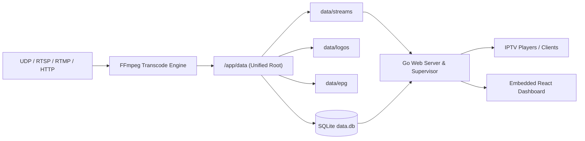

# Stream to IPTV: Comprehensive Features & User Guide

Welcome to the definitive guide for **Stream to IPTV 2.0**. This document details every feature of the management console, explains architectural workflows, and walks through end-to-end configuration for IPTV clients.

---

## Table of Contents
1. [Architecture & Storage Model](#1-architecture--storage-model)
2. [Initial Setup Wizard & Migration](#2-initial-setup-wizard--migration)
3. [Birds-Eye View Dashboard & Telemetry](#3-birds-eye-view-dashboard--telemetry)
4. [Stream Channels Management](#4-stream-channels-management)
   - [On-Demand vs Always-On Transcoding](#on-demand-vs-always-on-transcoding)
   - [Automated Failure Recovery (Self-Healing)](#automated-failure-recovery-self-healing)
   - [Auto-Generated Playback URLs](#auto-generated-playback-urls)
   - [Live FFmpeg Log Inspection](#live-ffmpeg-log-inspection)
5. [Seamless Category Management](#5-seamless-category-management)
6. [Logo Asset Library](#6-logo-asset-library)
7. [Multi-Source XMLTV EPG Guide & Fallback Aggregator](#7-multi-source-xmltv-epg-guide--fallback-aggregator)
8. [System Settings & Security](#8-system-settings--security)
9. [IPTV Client Setup Guide](#9-iptv-client-setup-guide)
10. [Data Backup, Restore & Volume Persistence](#10-data-backup-restore--volume-persistence)

---

## 1. Architecture & Storage Model

`stream-to-iptv` bridges heterogeneous live media streams (UDP multicast, RTSP, RTMP, HTTP/HTTPS HLS) into a standardized IPTV distribution ecosystem.



### Unified Root Directory
All application assets reside inside a single designated data directory (controlled via the `DATA_DIR` environment variable, defaulting to `./data` or `/app/data` in Docker):

```text
/app/data/
├── data.db             # Pure Go SQLite database (schema, streams, EPG mappings, users)
├── data.db-wal         # SQLite Write-Ahead Log
├── logos/              # Stored channel logo image files
├── epg/                # Cached upstream XMLTV files and merged generated_epg.xml(.gz)
└── streams/            # Temporary HLS segment buffers and .m3u8 playlists
```

Mounting a single host folder (`-v /host/path:/app/data`) guarantees complete state persistence across restarts, upgrades, and container rebuilds.

---

## 2. Initial Setup Wizard & Migration

When starting `stream-to-iptv` for the first time, no default administrative password exists.

1. Open your browser and navigate to `http://localhost:8068` (or your server's IP address).
2. The **Initial Setup Wizard** appears automatically.
3. Configure your administrative credentials:
   - **Username**: Desired administrator username.
   - **Password**: Secure password (minimum 4 characters, hashed using bcrypt).
4. **Migrate Existing `config.json` Channels**:
   - If an existing `config.json` file is detected from version 1.0, a prominent migration checkbox is presented.
   - Checking this box automatically imports all previously configured channels, media URLs, categories, and logos into the SQLite database.
5. Click **Complete Setup & Launch**. You are instantly authenticated into the management console.
6. On subsequent visits, the standard secure **Sign In** screen is displayed.

---

## 3. Birds-Eye View Dashboard & Telemetry

The **Dashboard** (`/dashboard`) provides real-time system visibility:

- **Active Transcodes**: Displays currently active FFmpeg processes versus total configured streams.
- **Memory Allocation**: Shows heap memory allocated by the Go runtime and total reserved system memory.
- **CPU & Concurrency**: Reports available hardware CPU cores and live Go routines.
- **Unified Storage**: Shows the absolute path of the active data directory.
- **Stream Health Troubleshooter**:
  - Live inspection card identifying any streams in an `error` state.
  - Displays failure reason, duration in error, and watchdog recovery status.
  - Offers immediate **Restart Now** manual remediation and one-click **View Error Log** inspection.

---

## 4. Stream Channels Management

The **Channels & Streams** page (`/`) serves as your master IPTV playlist control center.

### On-Demand vs Always-On Transcoding

Each channel can be configured with its own execution lifecycle:

| Mode | Behavior | Best Used For |
| :--- | :--- | :--- |
| **On-Demand** *(Default)* | FFmpeg is spawned **only** when an IPTV player tunes into the channel. An inactivity timer monitors client playback requests. If no player requests segments within the configured timeout (e.g. 180 seconds), FFmpeg terminates and temporary segments are purged. | Conserving server CPU, memory, and source bandwidth for large channel lists. |
| **Always-On** | FFmpeg runs 24/7 in the background. If a network blip occurs, the supervisor automatically reconnects with backoff. | Primary broadcast channels, sports feeds, or low-latency instant channel switching. |

### Automated Failure Recovery (Self-Healing)

Network glitches or source drops can temporarily stall an FFmpeg transcode.
- Each stream features a configurable **Failure Recovery Watchdog**.
- **Threshold (seconds)**: Defines how long a stream may remain in `error` before recovery intervenes (default: 30 seconds).
- When the threshold is reached, the supervisor gracefully purges stale segments, resets the process lifecycle, and automatically initiates a clean restart.

### Auto-Generated Playback URLs

Every stream generates an immutable, non-editable playback URL:
```text
http://<host>:<port>/stream/<channel-slug>/<channel-slug>.m3u8
```
- Includes a one-click **Copy URL** button directly in the edit modal and table row.
- Injected automatically into the master `#EXTM3U` playlist feed.

### Live FFmpeg Log Inspection

Click the **Terminal** icon next to any channel to open the real-time log inspector:
- Captures combined `stdout` and `stderr` directly from the running FFmpeg subprocess.
- Retains a circular ring buffer of the last 500 lines.
- Features auto-refresh every 2 seconds, auto-scrolling, and a one-click **Copy Logs** button for troubleshooting stream codecs, resolutions, and bitrates.

---

## 5. Seamless Category Management

IPTV players organize channels using the `#EXTINF group-title="..."` tag.

- **Centralized View**: Visit the **Categories** page (`/categories`) to create, rename, reorder, or delete categories.
- **Seamless In-Dialog Creation**:
  - You do **not** need to leave the stream editor to create a new category.
  - In the Stream Editor dialog, type a new category name into the `+ New Category...` input box and press **Enter** (or click **Add**).
  - The category is created in SQLite instantly and assigned to the current channel.
- **Multi-Category Support**: Assign multiple categories to a single stream; they are combined into standard semicolon-delimited group titles (e.g. `Sports;Live Events`).

---

## 6. Logo Asset Library

Channel logos are displayed inside your IPTV player's electronic program guide and channel list.

- **Local Storage**: Uploaded logos are saved locally inside `data/logos/` and assigned a content-hashed unique filename.
- **Reuse Across Channels**: Logos are indexed in a reusable gallery. Selecting an existing logo reuses the stored file without duplicating assets.
- **Import from URL**: Paste an external image URL and click **Download and save to local logo library** to cache it permanently.
- **Direct External URL**: Channels can also point directly to third-party web URLs if local caching is not desired.

---

## 7. Multi-Source XMLTV EPG Guide & Fallback Aggregator

Electronic Program Guides (EPG) tell your viewer what is playing now and next.

### Adding EPG Sources
1. Navigate to **EPG Sources** (`/epg`).
2. Enter the source name, XMLTV URL (supports both uncompressed `.xml` and gzip-compressed `.xml.gz`), and refresh interval (in hours).
3. The background worker downloads the file, decompresses it on the fly, and indexes channel names and TVG IDs into SQLite.

### Channel Mapping & Fallback
When editing a stream:
1. **TVG-ID**: Enter or auto-generate the channel's XMLTV guide identifier.
2. **Primary EPG**: Select an EPG source and use the autocomplete search bar to locate the exact channel.
3. **Fallback EPG (Optional)**: Select an alternative EPG provider and fallback channel ID.
   - If the primary provider has no schedule data for the day, the aggregator automatically falls back to schedule data from the secondary provider!

### Combined Translated Output
The aggregator compiles schedules for **only** your configured channels into:
- **XML**: `http://<host>:<port>/epg.xml`
- **GZIP**: `http://<host>:<port>/epg.xml.gz`

---

## 8. System Settings & Security

Access the **Settings** page (`/settings`) to configure:

- **Server Port**: Listening TCP port (default `8068`).
- **Public Base URL Override**: Specify an external domain or LAN IP (e.g. `http://192.168.1.50:8068`) to ensure generated M3U playlists reference the correct network address.
- **Secret Access Token**:
  - By default, IPTV player endpoints are public for convenient local streaming.
  - If a secret token is entered (e.g. `secret-token-123`), `/playlist.m3u` and `/epg.xml` require `?token=secret-token-123` to authenticate.

---

## 9. IPTV Client Setup Guide

### TiviMate / OTT Navigator (Android TV / Fire TV)
1. Open TiviMate &gt; **Settings** &gt; **Playlists** &gt; **Add Playlist**.
2. Select **M3U Playlist** and paste:
   ```text
   http://<SERVER_IP>:8068/playlist.m3u
   ```
3. In Playlist options &gt; **TV Guide (EPG)** &gt; **Add EPG Source**, paste:
   ```text
   http://<SERVER_IP>:8068/epg.xml.gz
   ```
4. Save and allow channels and guide data to synchronize.

### VLC Media Player (Desktop / Mobile)
1. Press `Ctrl+N` (or **Media &gt; Open Network Stream**).
2. Paste `http://<SERVER_IP>:8068/playlist.m3u` and click **Play**.
3. View the playlist sidebar (`Ctrl+L`) to toggle channels.

### Kodi (PVR IPTV Simple Client)
1. Open Kodi Add-ons &gt; **PVR IPTV Simple Client** &gt; **Configure**.
2. Set **M3U Play List URL** to `http://<SERVER_IP>:8068/playlist.m3u`.
3. Set **XMLTV URL** to `http://<SERVER_IP>:8068/epg.xml.gz`.

---

## 10. Data Backup, Restore & Volume Persistence

Because all state resides under `DATA_DIR` (`./data`):

### Backing Up
To create a complete backup of all database tables, channels, uploaded logos, and guide caches:
```bash
# Create a timestamped archive of the data directory
tar -czvf stream-to-iptv-backup-$(date +%F).tar.gz ./data
```

### Restoring
```bash
# Stop the stream container or service
docker stop stream-to-iptv

# Extract backup into the data folder
tar -xzvf stream-to-iptv-backup-YYYY-MM-DD.tar.gz -C ./

# Restart the service
docker start stream-to-iptv
```
All channels, users, categories, logos, and EPG sources will be restored identically.
